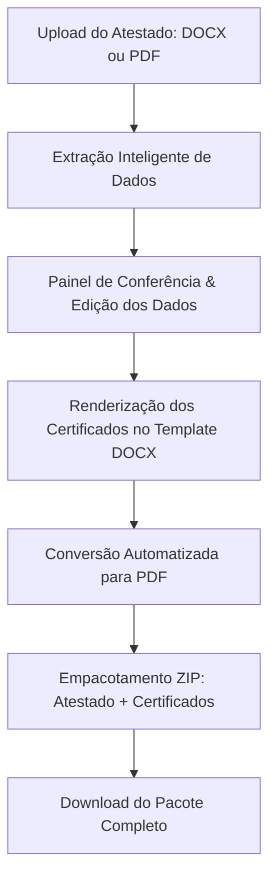

# 📜 Santana A3 - Emissor de Atestado & Certificados de Brigada

Aplicação web desenvolvida com **Streamlit** para automação completa do fluxo de extração de dados e emissão de **Atestados de Brigada de Incêndio** e seus respectivos **Certificados Individuais** em formato PDF.

---

## 🎯 Sobre o Projeto

Em processos de regularização e treinamentos de segurança contra incêndio e pânico, a confecção manual de certificados para dezenas de colaboradores a partir de um atestado é uma tarefa repetitiva e propensa a erros de digitação.

Este sistema resolve esse problema através da ingestão automatizada do atestado (em formato **Word (.docx)** ou **PDF**), identificação dos metadados da empresa/filial, leitura dos brigadistas participantes, preenchimento dinâmico de modelo padronizado e conversão instantânea de todos os arquivos para **PDF**, disponibilizando o resultado em um único pacote compactado (`.zip`).

---

## ✨ Principais Funcionalidades

- **📂 Upload Híbrido (.docx e .pdf):**
  - Leitura nativa de tabelas e textos via `python-docx` para arquivos Word.
  - Extração inteligente de texto e tabelas via `pdfplumber` para arquivos PDF.
- **🔍 Extração Automática de Metadados:**
  - Identificação de Empresa / Filial (com detecção do número da filial).
  - CNPJ da empresa/filial.
  - Data de realização/emissão por extenso.
  - Legislação/Norma Técnica de referência (ex.: CBMPI nº 17/2019, NTs dos Corpos de Bombeiros).
- **👥 Extração e Conferência de Alunos/Brigadistas:**
  - Tabela interativa contendo: Nome completo, CPF, Tipo de Treinamento, Nível (Básico, Intermediário, Avançado) e Carga Horária.
  - Painel de edição prévia na interface web para correções ou ajustes finos antes da geração.
- **📄 Geração Dinâmica de Certificados:**
  - Preenchimento baseado no modelo padrão (`modeloCertificado.docx`) utilizando Jinja2 tags através da biblioteca `docxtpl`.
- **⚡ Conversão Multiplataforma para PDF:**
  - **Linux / Streamlit Cloud:** Conversão em segundo plano via `libreoffice` headless (configurado no `packages.txt`).
  - **Windows:** Conversão nativa via automação COM do Microsoft Word (`win32com.client`).
- **📦 Empacotamento em Lote (.zip):**
  - Download em 1 clique contendo o Atestado em PDF + todos os Certificados individuais nomeados e padronizados.

---

## 🔄 Fluxo de Funcionamento



---

## 🛠️ Tecnologias e Bibliotecas

- **Streamlit**: Interface gráfica web reativa e amigável.
- **docxtpl**: Template engine para documentos Word com tags Jinja2.
- **python-docx**: Manipulação e leitura de arquivos `.docx`.
- **pdfplumber**: Extração detalhada de textos e tabelas em arquivos `.pdf`.
- **pandas**: Visualização tabular dos brigadistas na interface.
- **LibreOffice Headless**: Motor de conversão DOCX -> PDF para servidores e nuvem.

---

## 📁 Estrutura do Repositório

```text
├── app_web.py              # Aplicação principal Streamlit
├── modeloCertificado.docx  # Modelo Word de certificado com tags dinâmicas
├── logo_santanaa3.png      # Logotipo da aplicação
├── requirements.txt        # Dependências Python (Streamlit, docxtpl, etc.)
├── packages.txt            # Dependências de sistema para Streamlit Cloud (libreoffice)
└── README.md               # Documentação do projeto
```

---

## 🚀 Como Executar Localmente

### Pré-requisitos

- **Python 3.9+** instalado.
- **Microsoft Word** instalado (caso execute no Windows) ou **LibreOffice** (caso execute no Linux/macOS).

### Passo a passo

1. **Clone o repositório:**

   ```bash
   git clone https://github.com/FlavioHFranca/Gerador-de-Atestado-e-Certificados-brigadistas---Santana-A3.git
   cd Gerador-de-Atestado-e-Certificados-brigadistas---Santana-A3
   ```

2. **Crie e ative um ambiente virtual (recomendado):**

   ```bash
   # Windows
   python -m venv venv
   .\venv\Scripts\activate

   # Linux / macOS
   python3 -m venv venv
   source venv/bin/activate
   ```

3. **Instale as dependências:**

   ```bash
   pip install -r requirements.txt
   ```

4. **Inicie o servidor local do Streamlit:**

   ```bash
   streamlit run app_web.py
   ```

5. O navegador abrirá automaticamente no endereço `http://localhost:8501`.

---

## ☁️ Deploy no Streamlit Cloud

O projeto já está preparado para deploy no [Streamlit Community Cloud](https://share.streamlit.io/):

## 👨‍💻 Autor

Desenvolvido por **Flávio Henrique França** para **Santana A3**.
